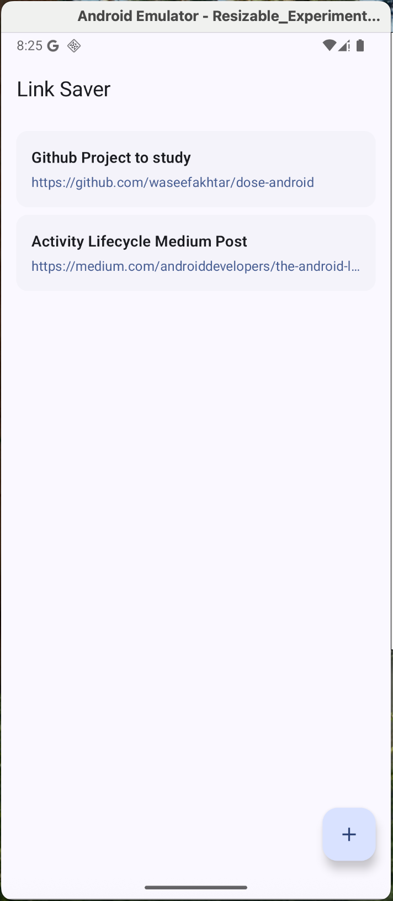
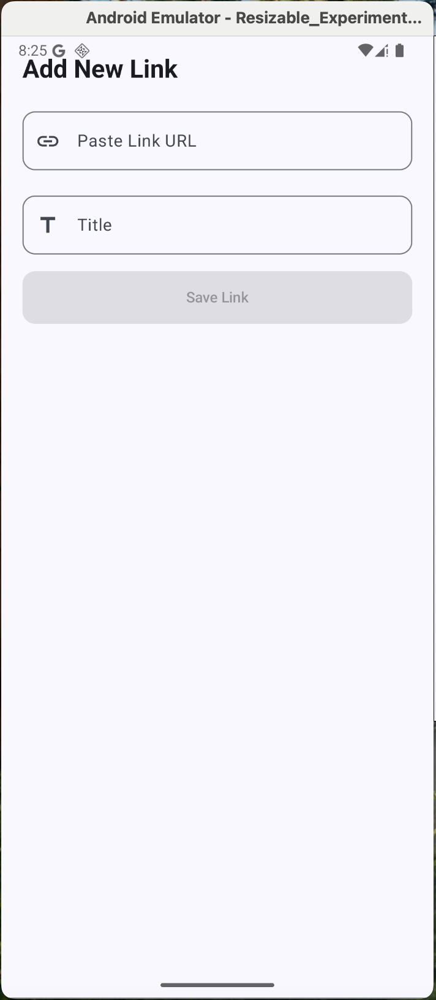

#### Video Demo:  https://youtu.be/X9-Q11-TnYQ
## Link Saver
   **Link Saver** is a Android App saving userful links for later built with **Kotlin** and **Jetpack Compose**, using **Room Database** to save links.

## Features
- Save links with Title
- Browse links to WebPage
- Delete with Swipe Delete

   

## Tech Stack
- Kotlin
- Jetpack Compose
- Hilt
- Room Database
- MVVM Architecture

## Screenshots

  
  

